# Cloud-based Honey Pots

## Summary:

This project aims to guide you through setting up a honeypot in the cloud. Hosting the honeypot in the cloud shields your home networks while still offering the chance to gather valuable insights into real-world attacks. The honey pot we will be using is T-Pot. 

## Why a Honey Pot?

A cybersecurity researcher might set up a honeypot for several key reasons, which all contribute to improving security measures, gaining insights into threat actors, and enhancing overall cybersecurity knowledge. Here’s a detailed look at why a cybersecurity researcher would deploy a honeypot:

### 1. Threat Intelligence Gathering
 - **Honeypots can capture detailed** Honeypots can capture detailed information about attack methods, tools, and tactics used by threat actors. This data helps researchers understand how attacks are executed and evolve over time.
 - **Identifying New Threats:** By attracting and logging malicious activity, honeypots can identify new or emerging threats that might not yet be widely known or documented.

### 2. Malware Collection and Analysis
 - **Capturing Malware Samples**: Honeypots can collect various types of malware, including viruses, worms, ransomware, and other malicious software. Researchers can analyze these samples to understand their behavior, propagation methods, and potential impacts.
 - **Reverse Engineering**: Analyzing the malware's code can provide insights into its functionality and objectives, helping develop detection and mitigation strategies.

### 3. Understanding Attacker Behavior
 - **Behavioral Analysis**: By observing how attackers interact with the honeypot, researchers can gain insights into their motives, techniques, and decision-making processes.
 - **Credential Use**: Logging attempts to use stolen or guessed credentials can provide information on common password patterns and the effectiveness of different authentication mechanisms.
  
### 4. Improving Defensive Measures
 - **Enhancing Detection Systems**: Data collected from honeypots can be used to improve intrusion detection and prevention systems (IDS/IPS) by creating more accurate and comprehensive signatures.
 - **Developing Countermeasures**: Insights gained from honeypot activity can inform the development of security policies, patches, and other countermeasures to protect real systems.
 
### 5. Training and Education
 - **Real-World Scenarios**: Honeypots provide a controlled environment for security professionals and students to observe and analyze real-world attacks without risking actual systems.
 - **Hands-On Experience**: Working with honeypots allows researchers and security teams to gain hands-on experience in detecting, analyzing, and responding to cyber threats.

### 6. Forensic Analysis
 - **Incident Response**: Honeypots can be used to study the aftermath of an attack, providing valuable forensic data that can be used to reconstruct the attack timeline and understand the attacker’s methods.
 - **Legal Evidence**: In some cases, data from honeypots can be used as evidence in legal proceedings against cybercriminals.
 
### 7. Vulnerability Research
 - **Identifying Weaknesses**: Honeypots can be configured to mimic specific systems or applications to identify and analyze vulnerabilities that attackers are exploiting.
 - **Zero-Day Exploits**: By attracting advanced attackers, honeypots can sometimes capture zero-day exploits that are not yet known to the public or vendors.
  
### 8. Enhancing Threat Sharing
 - **Collaborative Defense**: Data and insights from honeypots can be shared with the broader cybersecurity community, enhancing collective defense efforts against common threats.
 - **Threat Feeds**: Honeypot data can be integrated into threat intelligence feeds, providing up-to-date information on malicious IP addresses, domains, and attack patterns.

### Bottom Line
Honeypots are valuable tools for cybersecurity threat researchers, providing rich, real-world data on cyber threats and attacker behaviors. By deploying honeypots, researchers can enhance their understanding of the threat landscape, improve defensive measures, and contribute to the broader cybersecurity community.

### Choosing the Right Cloud Provider
Choosing the right cloud provider to deploy T-Pot involves several key considerations to ensure that the platform meets your performance, security, and cost requirements.
### Popular Cloud Providers to Consider
 **1. Amazon Web Services (AWS):**
  - Extensive global presence
  - Robust security and compliance features
  - Comprehensive service offerings and integrations
  
 **2. Microsoft Azure:**
  - Strong enterprise focus and integration with Microsoft products
  - High availability and reliability
  - Comprehensive compliance certifications
  
 **3. Google Cloud Platform (GCP):**
  - Competitive pricing and strong data analytics services
  - High performance and global reach
  - Strong focus on security and innovation
  
 **4. DigitalOcean:**
  - Simplified pricing and ease of use
  - Good performance for smaller-scale deployments
  - Developer-friendly with strong community support
  
 **5. Linode:**
  - Cost-effective pricing with transparent billing
  - Strong performance for small to medium-sized deployments
  - Good global coverage with multiple data centers
  - User-friendly interface and robust support
  
### **I chose Linode primarily because of the simplicity and free two month trial.**
**Pros of Cloud-Based T-Pot on Linode**
**1. Cost Efficiency:**
  - **Transparent Pricing:** Linode offers simple, transparent pricing that makes it easy to understand and predict costs.
  - **Affordable:** Often more affordable than some of the larger cloud providers, making it suitable for small to medium-sized deployments.
**2. Performance:**
  - **High Performance:** Known for good performance, particularly for smaller and medium-scale applications.
  - **SSD Storage:** Uses SSD storage for faster read/write speeds and overall better performance.
**3. Ease of Use:**
  - **User-Friendly Interface:** Linode's management console is straightforward and easy to use.
  - **Comprehensive Documentation:** Provides detailed documentation and tutorials to help users get started quickly.
**4. Support and Community:**
  - **Responsive Support:** Offers 24/7 customer support with knowledgeable staff.
  - **Strong Community:** Has a strong user community with forums and a wealth of community-contributed guides.
  
### Cons of Cloud-Based T-Pot on Linode
**1. Limited Advanced Features:**
  - **Fewer Advanced Services:** Compared to AWS, Azure, or GCP, Linode has fewer advanced cloud services and integrations.
  - **Basic AI/ML Support:** Lacks advanced machine learning and AI services that larger providers offer.
**2. Compliance and Security:**
  - **Limited Compliance Certifications:** May not have the same breadth of compliance certifications as larger providers, which could be a concern for highly regulated industries.
  - **Security Features:** While it offers essential security features, it may lack some of the advanced security services provided by larger cloud providers.
  
### Bottom Line
By considering these factors and comparing the offerings of different cloud providers, including Linode, you can choose the provider that best fits your requirements for deploying T-Pot. Each provider has its strengths and weaknesses, so your choice will depend on your specific needs, budget, and preferences.

## T-POT
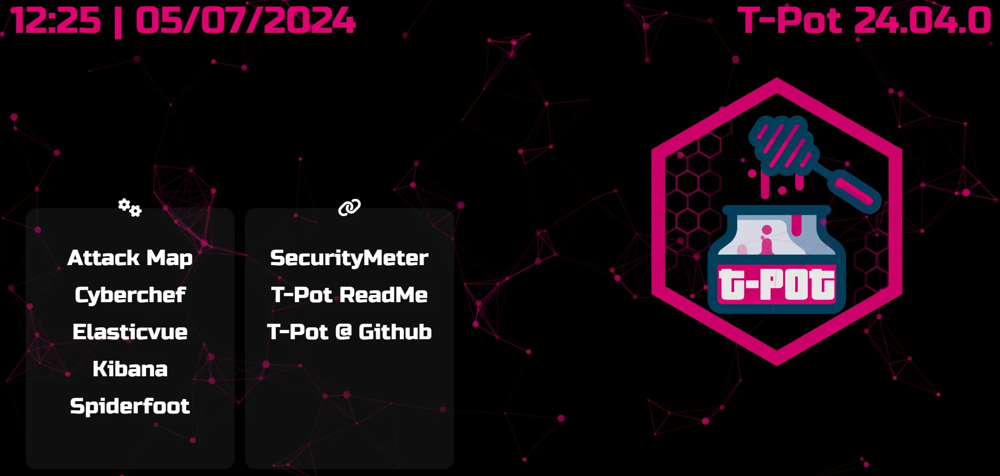
T-Pot, a comprehensive honeypot platform, is designed to collect a wide range of data to help in the analysis of cyber threats. Here’s a detailed breakdown of the types of data T-Pot can collect:

### Types of Data Collected by T-Pot
#### 1. Network Traffic:
  - **IP Addresses:** Logs the source and destination IP addresses of the traffic.
  - **Ports:** Records the ports being targeted.
  - **Protocols:** Captures various network protocols used in the traffic (e.g., TCP, UDP, ICMP).

#### 2. Attack Signatures:
  - **Payloads**: Collects the actual payloads of the attacks, which can include malicious code, exploits, and commands.
  - **Exploits**: Identifies and records specific exploits used against the honeypot services.
#### 3. Intrusion Attempts:
  - **Brute Force Attacks**: Logs attempts to guess passwords or keys.
  - **Scanning Activities**: Records port scans, vulnerability scans, and other reconnaissance activities.
#### 4. Malware Samples:
  - **Binary Files**: Captures malicious binaries and scripts dropped by attackers.
  - **Execution Logs**: Records the behavior and actions taken by the malware once executed.
#### 5. Session Data:
  - **Commands**: Logs commands executed by attackers, particularly on honeypot services that mimic SSH, Telnet, or web servers.
  - **Interactive Sessions**: Records interactive sessions to analyze attacker behavior.
#### 6. Files and Artifacts:
  - **Uploaded Files**: Collects files uploaded by attackers to the honeypot.
  - **Modified Files**: Monitors and logs changes made to files within the honeypot environment.
#### 7. Credential Usage:
  - **Credentials**: Logs the usernames and passwords used in login attempts.
  - **Authentication Attempts**: Records successful and failed authentication attempts.
#### 8. Exfiltration Attempts:
  - **Data Leaks:** Monitors and logs any attempts to exfiltrate data from the honeypot.

## Specific Honeypot Tools and Their Data
T-Pot integrates several honeypot tools, each designed to capture specific types of data:
 - **Dionaea**: Captures malware and exploits for various services.
 - **Cowri**e: An SSH and Telnet honeypot that logs commands and sessions.
 - **Conpot**: An ICS/SCADA honeypot that emulates industrial control systems.
 - **Elasticpot**: Mimics Elasticsearch to capture attacks targeting this service.
 - **Heralding**: Captures login attempts and credentials for various network services.
 - **Mailoney**: Collects data from email-based attacks.
 - **Surricata**: Network Traffic 
  
## Data Storage and Analysis
 - **Elastic Stack (ELK)**: T-Pot uses Elasticsearch, Logstash, and Kibana for storing, processing, and visualizing the collected data.
 - **Suricata:** An intrusion detection system that provides additional network traffic analysis and logs.

By capturing and analyzing this data, T-Pot provides valuable insights into the methods and tactics used by attackers, helping improve security measures and threat intelligence.


## Setting up the Honey Pot
Now that we have the background information covered lets get started!!!
 We are going to build the T-Pot honey pot on top of an Ubuntu server. 
### Step 1: Create a Linode Account
 1. Go to the Linode website and sign up for an account. Find a free offer on-line. Below is a link to a current offer from Network Chuck’s YouTube channel.
 [Youtube](https://www.youtube.com/redirect?event=video_description&redir_token=QUFFLUhqbThUdHJxVV9NaUozVjd1NTRWNXU1X1FodzlVQXxBQ3Jtc0trc1JheXdCd3ZBeE9sZi1nUVE0Rkc4UUt5b1NKMzZ2Y1ZzbnBiMHd4YWJhM3FUenRZZ21lNVpfS1hobmFtNTUxQTZvYjQyMktqVXc1WlhyUDExWGY3QWM1ZDFtdGE5RV9RR1lRSEVyYWhNc3VCZlF3OA&q=https://ntck.co/linode&v=nTqu6w2wc68)

 2. Complete the registration process and log in to your Linode account.
   
### Step 2: Create a New Linode
Linode calls its VMs “Linodes”
 1. Once logged in, navigate to the Linode dashboard.
 2. Click on the "Create" button and select "Linode" from the dropdown menu.
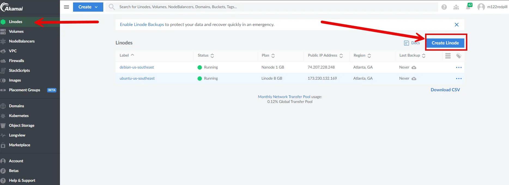

### Step 3: Configure Your Linode
 1. Choose a Distribution: Select "Ubuntu" as your operating system. You can choose the latest LTS version available.
 2. Region: Select the data center region closest to you or your target audience for better latency.
 3. Linode Plan: Choose a plan that fits your needs. The Shared CPU plans are usually sufficient for most use cases. T-Pot documentation recommends at least 8-16 GB RAM, 128 GB free disk space.
   
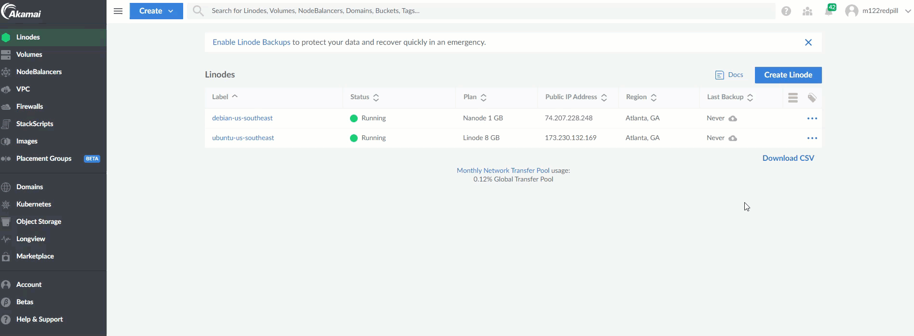

 4. Linode Label: Enter a label to identify your Linode.
 5. Root Password: Set a strong root password for your server.
   
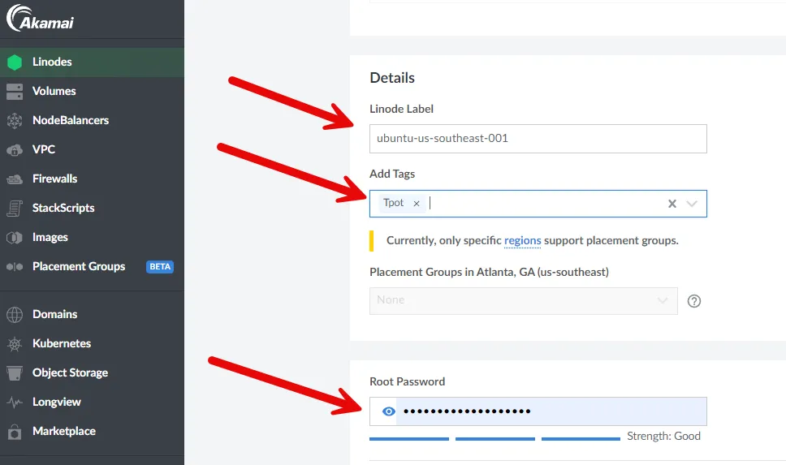

### Step 4: Deploy Your Linode
 1. Review your configuration and click the "Create Linode" button.
 2. Wait for Linode to provision your server. This may take a few minutes.

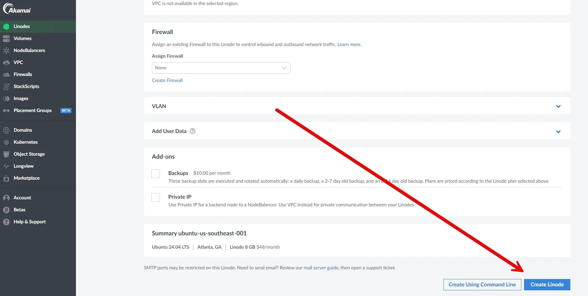

### Step 5: Access Your Linode
 1. Once your Linode is running, you will see it listed on the dashboard.

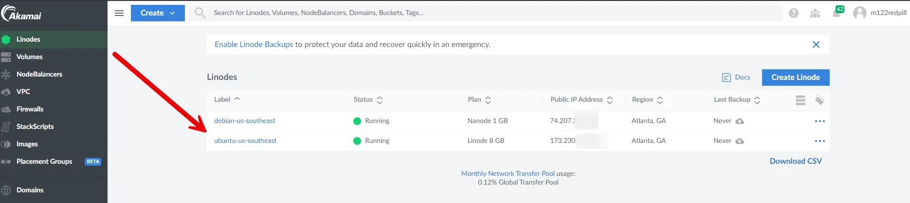

 2. Click on your Linode to access its details.
 3. Note the public IP address assigned to your Linode.

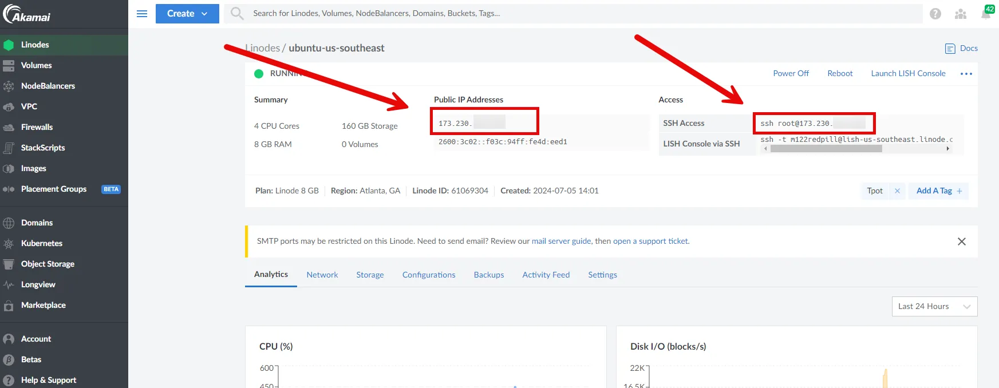

### Step 6: Connect to Your Linode
 1. SSH to the server. If you are on a Windows machine I recommend using putty. If you are on a Mac or Linux you can use the terminal.
   
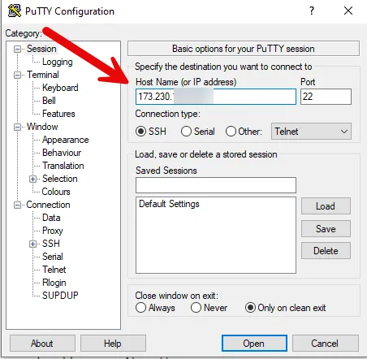

 2. Login as root and use the password you set up when creating the Linode.


 3. Once logged in, create a new user. This step is necessary because the T-Pot installation script cannot be run as the root user. Use the command below to create a new user:

```go 
adduser <your user name>
```
You will be prompted to create a password.

 4. Add the new user to the sudoer group by using the command below:

```go
usermod -aG sudo <you user name>
```
 5. Switch to the new user using the command below:

```go
su <your user name>
```

## Install T-Pot
1. Once you have changed users, change the directory to the $HOME directory.

```go
cd $HOME
```
2. Run the following command:
```go
env bash -c "$(curl -sL https://github.com/telekom-security/tpotce/raw/master/install.sh)"
```
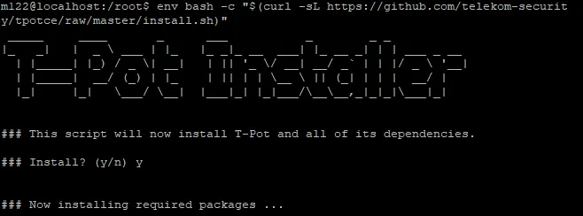

3. When completed you should receive the message seen below that asks you to reboot the system.

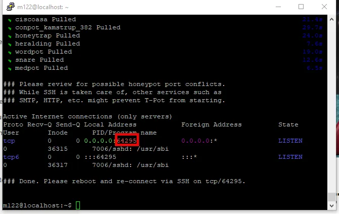

Note the port number. 
The next time you ssh to the server use that port number (64295) instead of port 22.

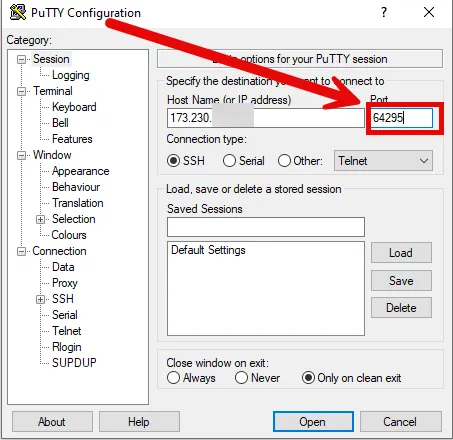

## Connect to T-POT Dashboard
Navigate to your dashboard (https://<your server IP>:64297) 

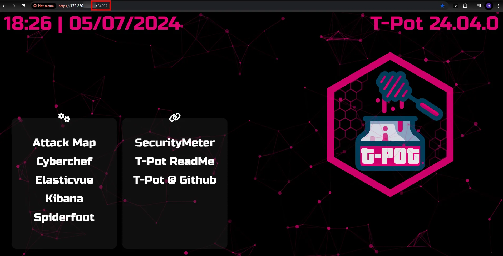

You are now connected and the honeypot is online and is likely already being attacked.
Select the Attack Map for a pew pew map view.

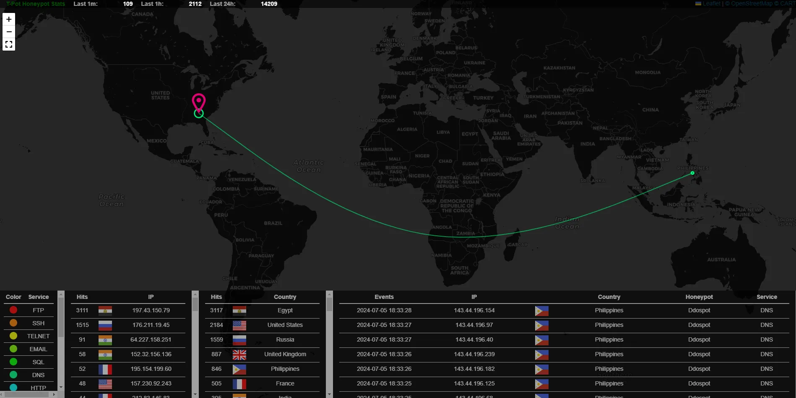

T-Pot also includes Cyberchef in case you need to decode anything.

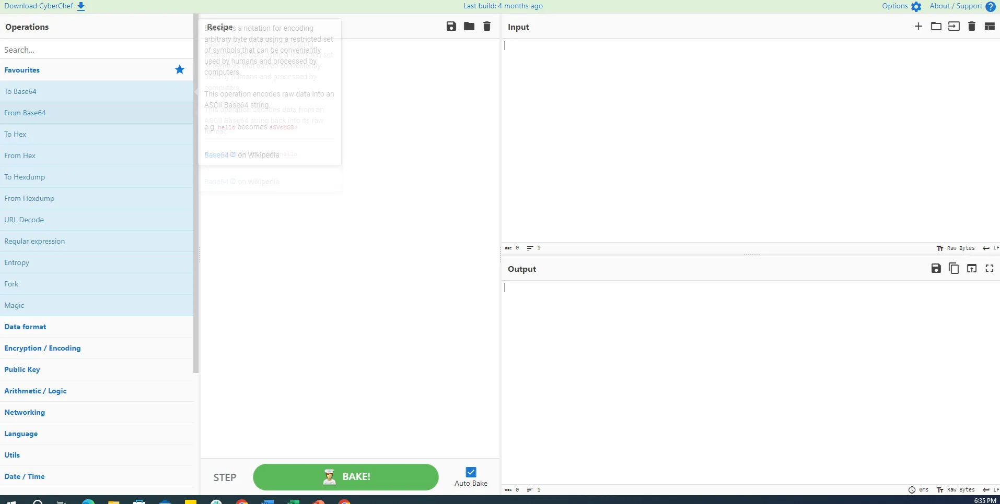

The Kibana menu will be the most used menu item. It is where the various dashboards are located. 

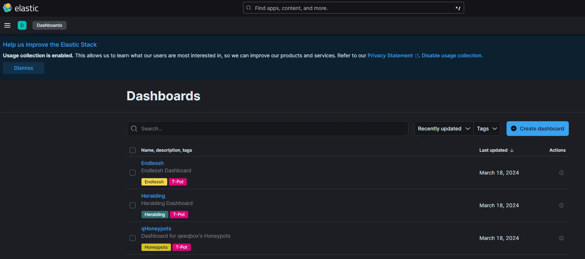

## Specific T-Pot Tool Dashboards and Their Data
T-Pot integrates several honeypot tools, each designed to capture specific types of data:
 - Dionaea: Captures malware and exploits for various services.

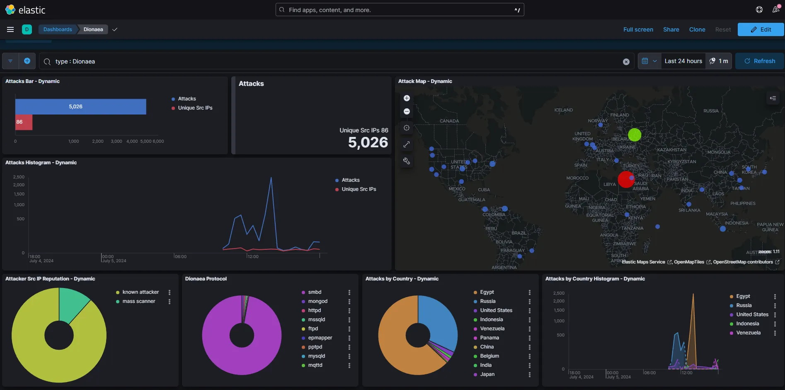

 - Cowrie: An SSH and Telnet honeypot that logs commands and sessions.

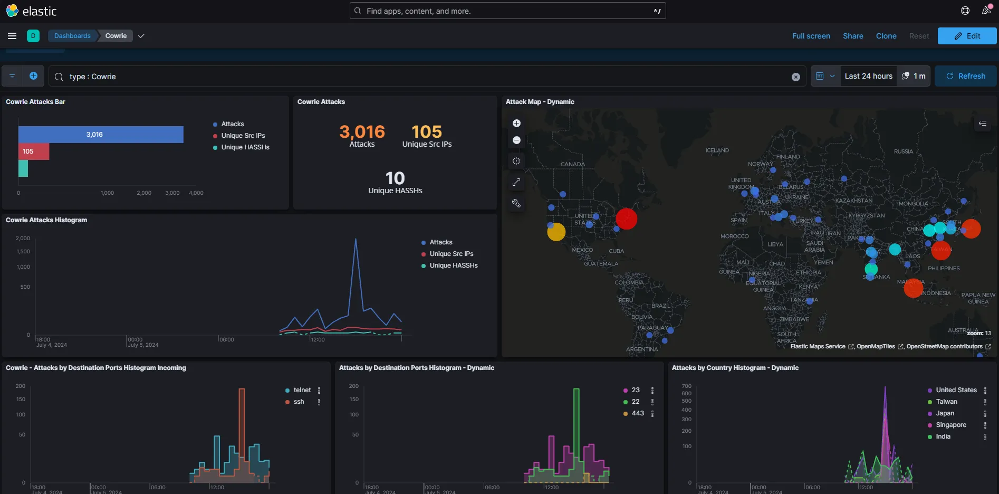

 - Conpot: An ICS/SCADA honeypot that emulates industrial control systems.

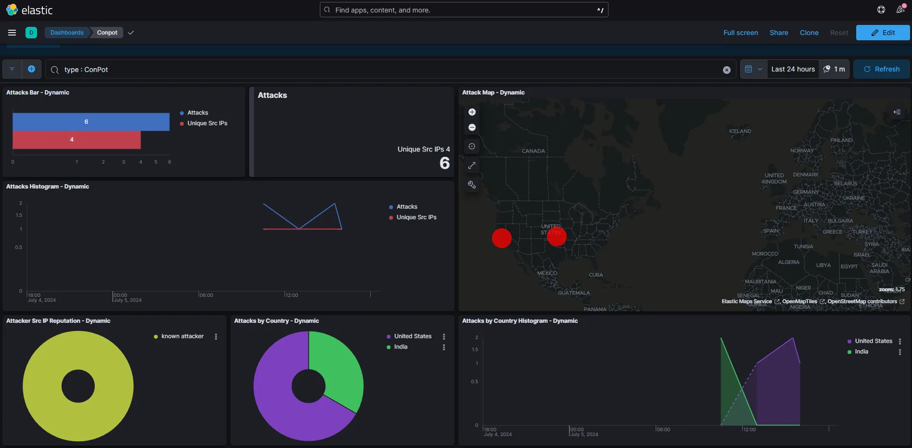

 - Elasticpot: Mimics Elasticsearch to capture attacks targeting this service.

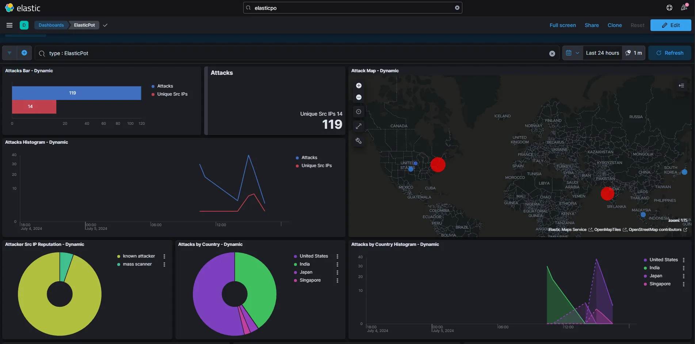

 - Mailoney: Collects data from email-based attacks.

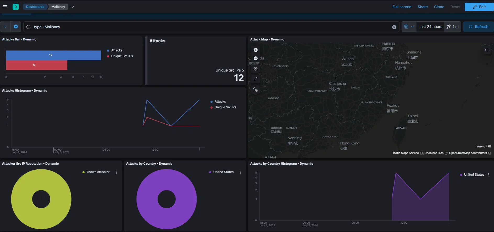

 - Surricata: Network Traffic 

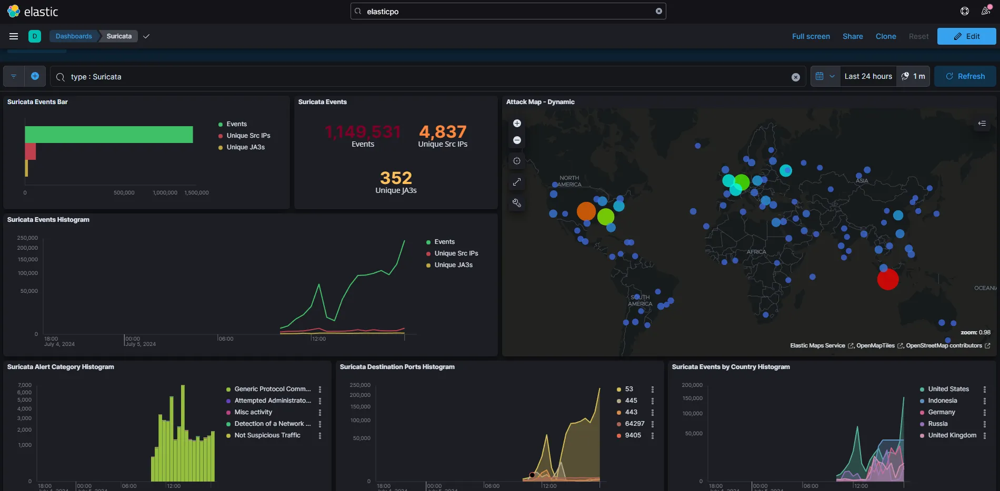

You now have a working honey pot collecting attack information. In the next walkthrough we will cover analysis of the information being collected, including recovering and analyzing malware samples that were used against our honey pot.