# Intro to Analyzing Honey Pot Data

## Summary:

In the previous blog we set up a honey pot in the cloud to collect attack data. Now what do we do with the data? In this blog we will discuss how we can analyze the data we are collecting from the honeypot. 

### Honeypot Tools and Their Data

As a review, there T-Pot integrates several honeypot tools, each designed to capture specific types of data. Below are just a few examples.

- **Dionaea**: Captures malware and exploits for various services.
- **Cowrie**: An SSH and Telnet honeypot that logs commands and sessions.
- **Conpot**: An ICS/SCADA honeypot that emulates industrial control systems.
- **Elasticpot**: Mimics Elasticsearch to capture attacks targeting this service.
- **Heralding**: Captures login attempts and credentials for various network services.
- **Mailoney**: Collects data from email-based attacks.
- **Surricata**: Network Traffic

## **Dionaea**

Since I am interested in malware, the first honeypot tool we will analyze is from Dionaea. Dionaea is an open-source honeypot designed to trap and analyze malicious activities by emulating a range of vulnerable services. Here’s a detailed overview of Dionaea:

### Dionaea Features and Capabilities:

1. **Service Emulation**:
    - **SMB**: Server Message Block protocol used primarily for providing shared access to files, printers, and serial ports.
    - **HTTP/HTTPS**: Web services to capture web-based attacks.
    - **FTP**: File Transfer Protocol services.
    - **MySQL**: Database services.
    - **TFTP**: Trivial File Transfer Protocol services, often targeted by certain malware.
    - **MS-SQL**: Microsoft SQL Server services.
    - **SIP**: Session Initiation Protocol for voice over IP services.
    - **MQTT**: Message Queuing Telemetry Transport protocol often used in IoT devices.
    - **RDP**: Remote Desktop Protocol services.
2. **Malware Capture**:
    - Dionaea is capable of capturing malware that exploits vulnerabilities in the emulated services.
    - It saves the binaries of the malware for further analysis.
3. **Exploitation Detection**:
    - The tool logs the exploitation attempts, providing details about the source of the attack and the nature of the exploitation.
4. **Protocol Emulation**:
    - Dionaea can emulate different protocols to attract diverse types of attacks, making it versatile in capturing a wide range of malware and exploit attempts.
5. **Logging and Reporting**:
    - It logs various details about the attacks, including the IP address, timestamp, and the type of exploit used.
    - Logs can be stored in multiple formats, including SQLite and JSON.
6. **Modularity**:
    - The tool is designed to be modular, allowing for the easy addition of new protocols and features through its plugin architecture.

## Analysis

Starting with the dashboard we can see that the vast majority of attacks picked up by Dionaea are abusing the SMB protocol. The majority of the attacks originated within the United States and were from known attackers. 

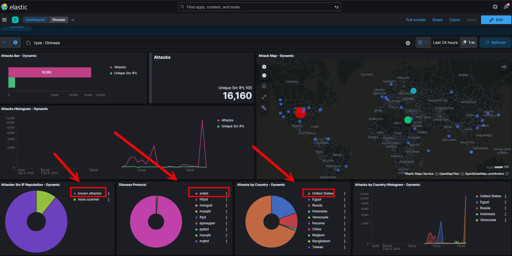

Correlating the top IP addresses with Virus Total shows confirms that these IP addresses have been associated with malicious activity in the past.  

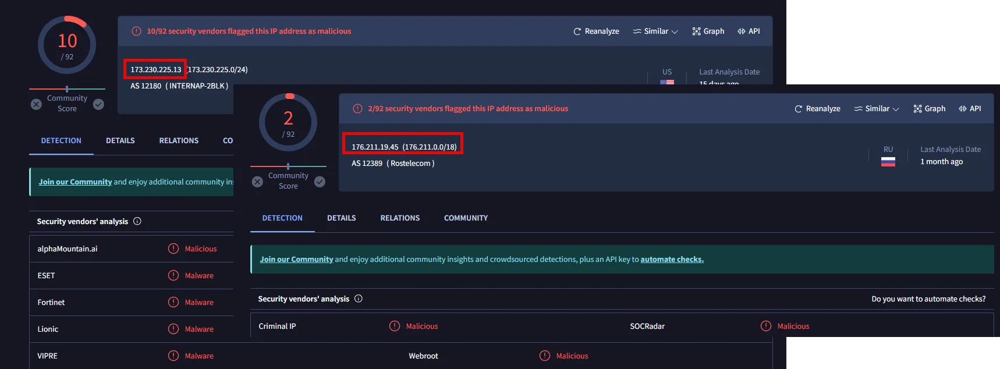

At the macro level this information is interesting. However, blocking IP addresses is like playing whack-a-mole. David Bianco’s Pyramid of Pain identifies that it is trivial for a malicious actor to overcome blocking IP addresses. The value of Dionaea and other honeypot tools is the ability to collect malware samples. This will allow us to conduct malware analysis and build rules and detections/alerts on the malware behavior. 

To retrieve the malware we need to ssh into the T-Pot server over port 64295. The path to the malware samples is /tpotce/data/dionaea/binaries.

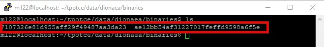

As seen above there were two unique malware samples collected. To quickly triage the samples we can run the hashes in VirusTotal. As seen below both were identified as being malicious. In fact, one was WannaCry, which should not be surprising considering that the majority of the attacks were attempting to abuse SMB. WannaCry uses the leaked NSA exploit EternalBlue to abuse SMB.

 

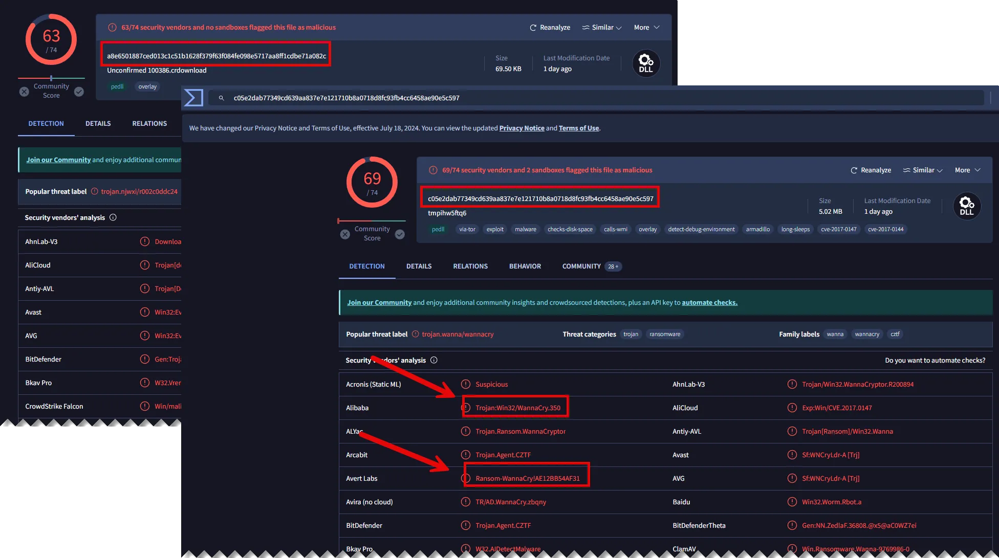

We can recover the malware samples by using the SCP protocol. If we are using Linux or a Mac we can run SCP from the terminal. On a Windows system you can use the GUI tool WinSCP. However, the most secure way to move the malware samples is to zip and password protect them. This can be done via ssh, but you must install zip on the T-Pot server with the command below:

```go
sudo apt install zip
```

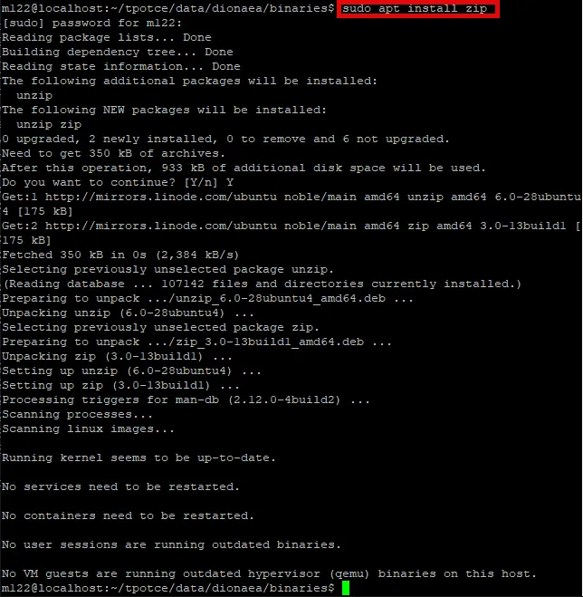

You can zip and password protect the file by using the command below:

```go
sudo zip -e archive_name.zip file_to_zip
```

Replace archive_name.zip with the desired name for your zip file and file_to_zip with the name of the file you want to zip and protect. You will be prompted to enter and verify a password.

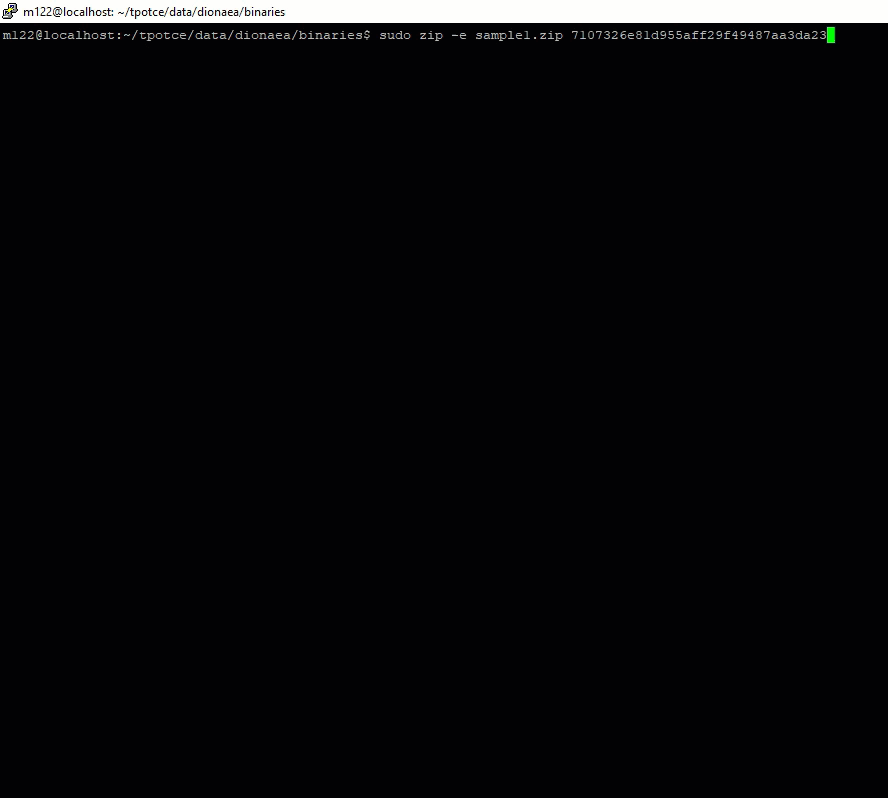

After zipping both files you can safely move them to your malware analysis machine using WinSCP.

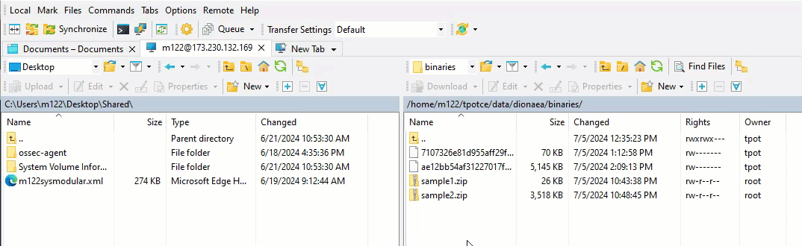

You can now conduct malware analysis on the two malware samples.

# Cowrie

Cowrie is a well-known open-source honeypot designed to emulate SSH and Telnet services, allowing researchers and security professionals to capture and analyze unauthorized access attempts.

### Cowrie Features and Capabilities

1. **SSH and Telnet Emulation**:
    - **SSH**: Secure Shell protocol emulation, capturing login attempts and commands executed by attackers.
    - **Telnet**: Emulates Telnet services, which are still used in some legacy systems, attracting a different set of attackers.
2. **Session Logging**:
    - **Command Logging**: Records all commands entered by attackers, providing insights into their actions and intentions.
    - **Interactive Session Logging**: Captures entire interactive sessions, which can be replayed for analysis.
3. **File System Emulation**:
    - **Virtual File System**: Emulates a fake file system that attackers can interact with, containing fake files and directories.
    - **File Download and Upload**: Captures files downloaded and uploaded by attackers, aiding in malware analysis.
4. **Credential Harvesting**:
    - Logs all credentials (usernames and passwords) used in login attempts, which can be useful for understanding commonly used credentials and attack patterns.

### Bottom Line

Cowrie is a powerful tool in the cybersecurity toolkit, offering detailed insights into unauthorized access attempts and attacker behavior. It helps security professionals and researchers enhance their understanding of threats and improve overall security posture.

## Analysis

The Cowrie dashboard provides a macro-level characterization of the SSH and Telnet attacks. This includes the number and type of attacks, as well as where the attacks are coming from.

 

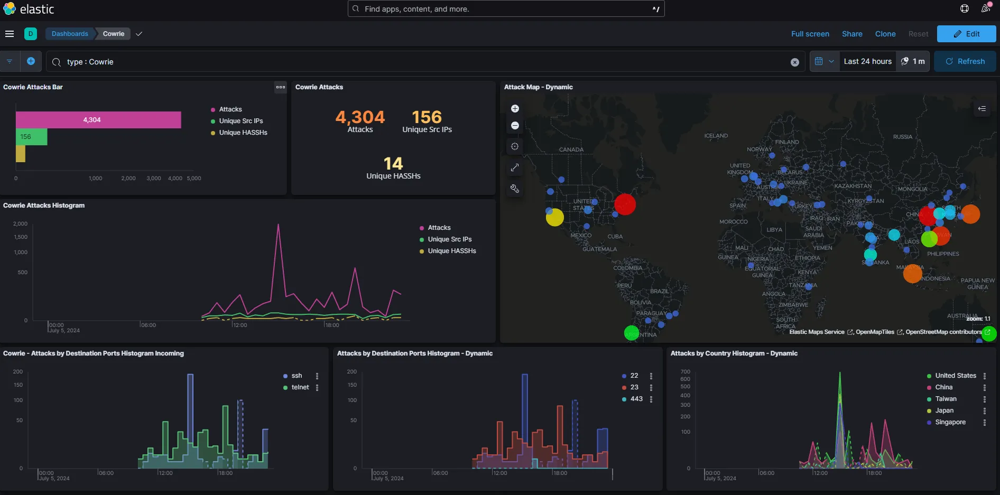

Additionally, it includes the top user names and passwords attempted during the attacks, as well as the command line inputs used during the attack.

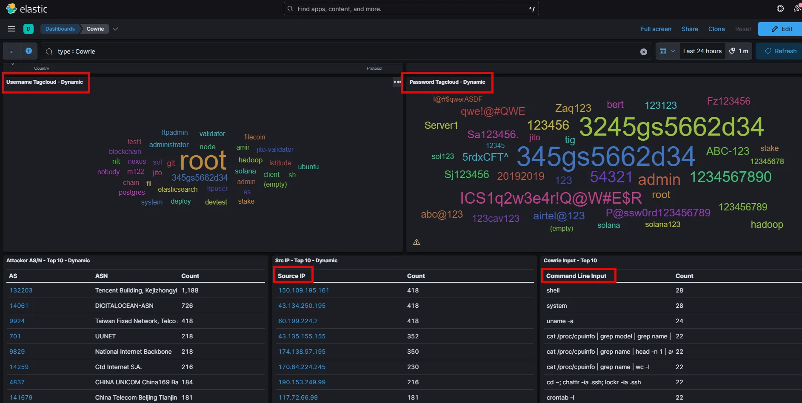

Once again, the dashboard provides a high level view of activity. We can dig deeper by using the Discover and Visualization features of Kibana.

In the Discover feature we can filter for Cowrie logs and the input field, which includes the command line inputs. The results show what commands the attacker ran from the CLI.

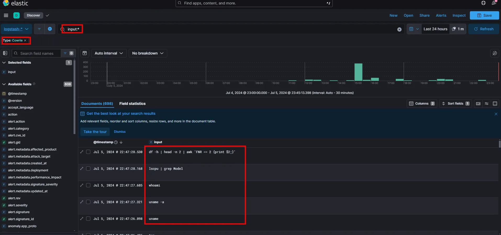

By using the Visualization feature we can build a table that shows the unique commands that were ran and the number of times they were ran.

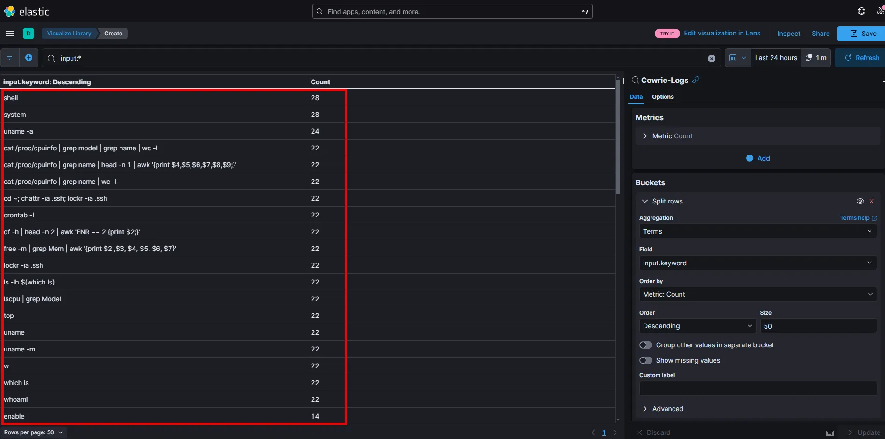

We could create the same type of tables for any fields, including IP addresses.

### Parsing Cowrie logs with CLI

Install jq

```go
sudo apt install jq
```

Navigate to logs

```go
cd tpotce/data/cowrie/log
```

Read logs

```go
jq . cowrie.json
```

In the example below head -20 was added to the command so that only the first 20 lines appeared.

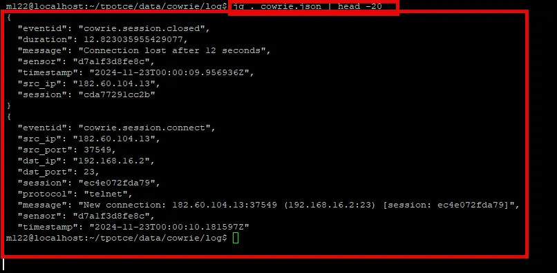

Parse for all the commandline inputs from the attackers.

```go
jq '. | select(.eventid == "cowrie.command.input") | .input' cowrie.json
```

In the example below head -20 was added to the command so that only the first 20 lines appeared.

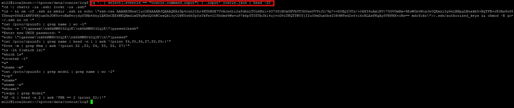

Count the number of unique occurrences of commandline

```go
jq -r 'select(.eventid == "cowrie.command.input") | .input' cowrie.json | sort | uniq -c | sort -nr
```

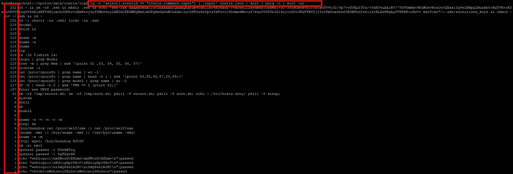

In the screenshot above, note the number of occurences on the left hand column.

Analyze login attempts

```go
jq '. | select(.eventid == "cowrie.login.failed") | .username, .password' cowrie.json
```

The results will be usernames and passwords. Once again, head -20 was used.

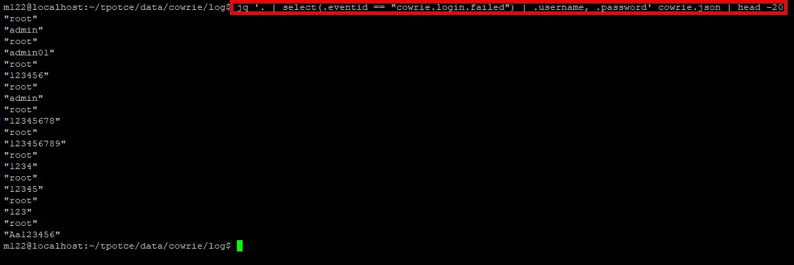

Count the number of unique password occurrences

```go
jq -r 'select(.eventid == "cowrie.login.failed") | .password' cowrie.json | sort | uniq -c | sort -nr
```

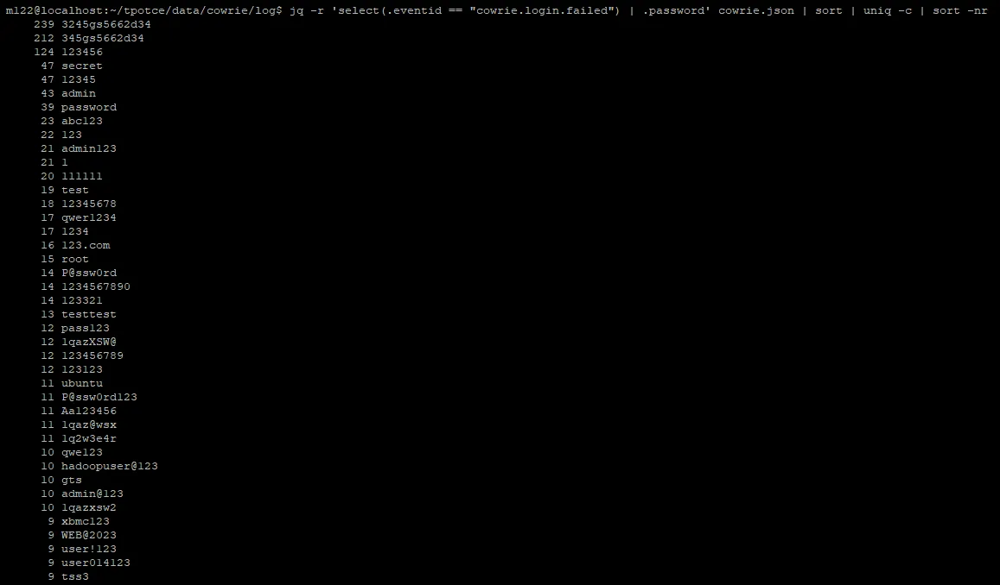

Count the unique usernames.

```go
jq -r 'select(.eventid == "cowrie.login.failed") | .username' cowrie.json | sort | uniq -c | sort -nr
```

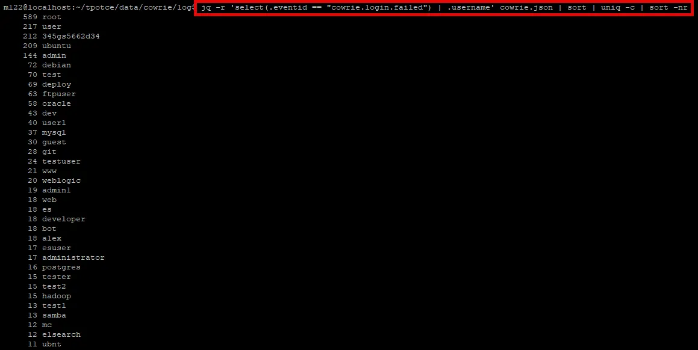

### Downloaded Malware

Additionally, if any files were downloaded to the honeypot, we can retrieve those by using SSH to the server, similar to the way we previously did with Dionaea. The path to the Cowrie downloads is tpotce/data/cowrie/downloads.

As seen below, no files were downloaded; however, the honeypot has only been online for a few hours. Ideally the honeypot should run for a few days before beginning analysis.

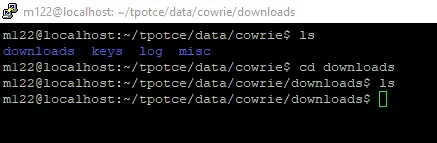

# Heralding

Heralding is a unique and specialized open-source honeypot designed primarily to act as a credentials logging service for various protocols. It is particularly effective for capturing and analyzing login attempts across multiple services.

### Heralding Features and Capabilities

1. **Protocol Emulation**:
    - **SSH**: Secure Shell protocol, capturing credentials used in SSH login attempts.
    - **Telnet**: Captures login attempts and credentials used with the Telnet protocol.
    - **FTP**: File Transfer Protocol, logging login attempts and credentials.
    - **HTTP/HTTPS**: Captures credentials submitted through basic and digest authentication methods.
    - **SMTP**: Simple Mail Transfer Protocol, logging login attempts for email servers.
    - **POP3**: Post Office Protocol, capturing email access credentials.
    - **IMAP**: Internet Message Access Protocol, capturing credentials used for accessing email.
    - **VNC**: Virtual Network Computing, capturing login attempts and credentials.
2. **Credential Logging**:
    - Logs all credentials (usernames and passwords) attempted across various protocols.
    - Provides detailed information about the source of the login attempts, including IP addresses and timestamps.

### Heralding Use Cases

1. **Credential Harvesting**:
    - Ideal for environments where capturing and analyzing login attempts and credentials is crucial.
    - Helps in understanding common credentials used by attackers and identifying weak passwords.
2. **Threat Intelligence**:
    - Provides valuable data on login attempts, helping to identify patterns in attacks and common sources of credential-based attacks.
    - Useful for developing threat intelligence and improving defensive measures against credential stuffing and brute force attacks.
3. **Network Security Monitoring**:
    - Deployed in networks to detect and log unauthorized access attempts.
    - Acts as an early warning system by capturing credentials used in attempted logins, allowing for proactive responses.
    
    Heralding is a powerful and specialized honeypot tool that offers focused logging of credentials across multiple protocols. Its lightweight design and detailed logging capabilities make it an excellent choice for organizations looking to improve their understanding of credential-based attacks and enhance their overall security posture.
    
    ## Analysis
    
    The dashboard provides the number of attacks and where they originated.
    
    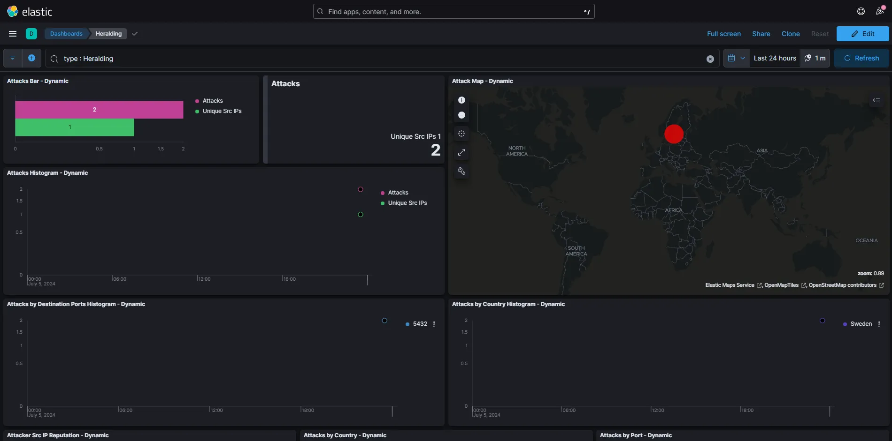
    
    Additionally, it shows the protocol, username and password attempted. 
    
    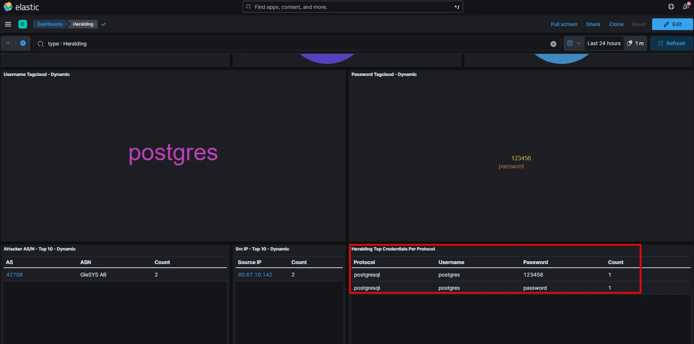
    
    # Ciscoasa
    
    The Cisco ASA (Adaptive Security Appliance) module in T-Pot is designed to emulate a Cisco ASA firewall, providing a high-interaction honeypot environment to attract and analyze attacks targeting this specific type of network device. T-Pot is a comprehensive honeypot platform that integrates multiple honeypot technologies, and the inclusion of the Cisco ASA module enhances its capability to mimic real-world enterprise environments.
    
    ### Features and Capabilities
    
    1. **Emulation of Cisco ASA Firewall**:
        - **Command Execution**: Emulates the command-line interface (CLI) of a Cisco ASA firewall, allowing attackers to interact with it as they would with a real device.
        - **Configuration Simulation**: Provides a realistic environment where attackers can attempt to view or modify firewall configurations.
    2. **Logging and Analysis**:
        - **Command Logging**: Records all commands entered by attackers, capturing their actions and methodologies.
        - **Session Logging**: Logs entire interactive sessions, which can be replayed for detailed analysis.
    3. **Credential Capture**:
        - Captures credentials (usernames and passwords) used in login attempts, providing insights into common passwords and credential-based attack patterns.
    4. **High-Interaction Environment**:
        - Offers a high-interaction environment that closely mimics a real Cisco ASA firewall, increasing the likelihood of capturing sophisticated attack techniques and behaviors.
    5. **Integration with T-Pot**:
        - Seamlessly integrates with the T-Pot platform, benefiting from its centralized logging, analysis, and visualization capabilities.
        - Contributes to the overall threat intelligence gathered by the T-Pot ecosystem, enriching the data available for analysis.
        
        ### Use Cases
        
        1. **Research and Analysis**:
            - Security researchers use the Cisco ASA module to study attack techniques and tactics targeting Cisco ASA firewalls.
            - Provides a platform for analyzing how attackers attempt to exploit firewall vulnerabilities or misconfigurations.
        2. **Threat Intelligence**:
            - Contributes valuable data to threat intelligence efforts by capturing and analyzing real-world attacks.
            - Helps in identifying emerging threats and attack trends targeting enterprise network security devices.
        3. **Network Security Monitoring**:
            - Deployed within enterprise networks to detect and log unauthorized access attempts on firewall devices.
            - Acts as a decoy to divert attackers from actual critical infrastructure, reducing the risk of successful breaches.
        
        ### Benefits
        
        - **Realistic Emulation**: Provides a realistic simulation of a Cisco ASA firewall, increasing the attractiveness to attackers and the quality of captured data.
        - **Comprehensive Logging**: Offers detailed logging of attacker interactions, aiding in the thorough analysis of attack techniques and behaviors.
        - **Enhanced Security Posture**: By attracting and analyzing attacks on emulated firewalls, organizations can improve their understanding of threats and enhance their defensive measures.
        
        The Cisco ASA module in T-Pot is a valuable tool for security researchers and organizations aiming to study and defend against attacks targeting Cisco ASA firewalls. Its realistic emulation and integration with the T-Pot platform make it a powerful component in a comprehensive honeypot strategy.
        
        ## Analysis
        
        The dashboard provides the same type of information as previously discussed dashboards, with the major exception that these attacks are targeting Cisco ASA firewalls. This is important information if your organization is using Cisco ASA firewalls.
        
        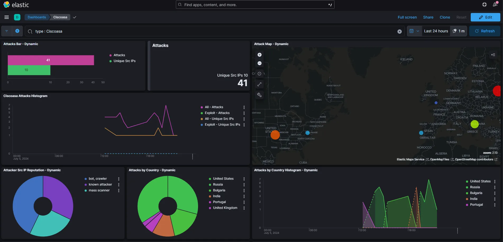